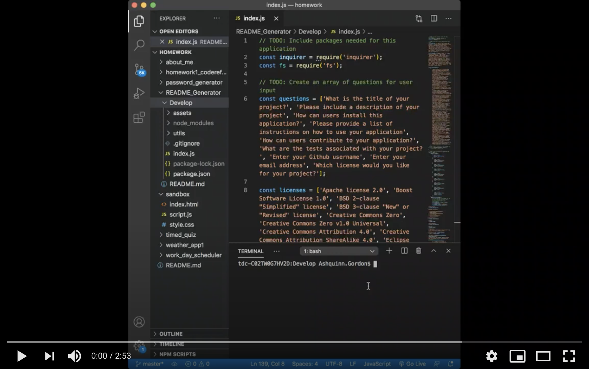

# README_Generator

## Description

        
## Installation     
In order for users to install and use this application they must first first install a package.json and the inquirer dependency. Once the user has those utilites installed they can inact the application by typing the followiing command into the command line:

```md
node index.js
```

Once the user runs the command they will be given a series of prompts in order to structure thier README file.

## User Story

```md
AS A developer
I WANT a README generator
SO THAT I can quickly create a professional README for a new project
```  
 ## Acceptance Criteria

```md
GIVEN a command-line application that accepts user input
WHEN I am prompted for information about my application repository
THEN a high-quality, professional README.md is generated with the title of my project and sections entitled Description, Table of Contents, Installation, Usage, License, Contributing, Tests, and Questions
WHEN I enter my project title
THEN this is displayed as the title of the README
WHEN I enter a description, installation instructions, usage information, contribution guidelines, and test instructions
THEN this information is added to the sections of the README entitled Description, Installation, Usage, Contributing, and Tests
WHEN I choose a license for my application from a list of options
THEN a badge for that license is added near the top of the README and a notice is added to the section of the README entitled License that explains which license the application is covered under
WHEN I enter my GitHub username
THEN this is added to the section of the README entitled Questions, with a link to my GitHub profile
WHEN I enter my email address
THEN this is added to the section of the README entitled Questions, with instructions on how to reach me with additional questions
WHEN I click on the links in the Table of Contents
THEN I am taken to the corresponding section of the README
```

## Demo 



## Questions       
If you have any questions please contact me by email or through my GitHub profile
        
* GitHub Profile: Ashquinn
* Email: ashquinngordon@gmail.com
        
## License      
Licensed under the Mozilla Public License 2.0 license. Use the following link for permissions and allowances:
https://opensource.org/licenses/MPL-2.0
